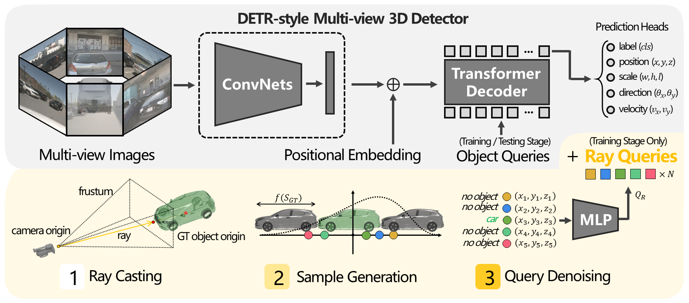

<div align="center">
<h1>RayDN</h1>
<h1>Ray Denoising: Depth-aware Hard Negative Sampling  for Multi-view 3D Object Detection</h1>
</div>

[](https://paperswithcode.com/sota/3d-object-detection-on-nuscenes-camera-only?p=beam-beta-distribution-ray-denoising-for)
[](https://arxiv.org/abs/2402.03634)

[<video src="figs/RayDN.mp4"></video>](https://github.com/LiewFeng/RayDN/assets/42316773/de2c229b-0f6a-4456-b72c-508ea6161198)


## Introduction

This repository is an official implementation of our ***ECCV 2024*** paper [Ray Denoising: Depth-aware Hard Negative Sampling for Multi-view 3D Object Detection](https://arxiv.org/abs/2402.03634). This repository contains Pytorch training code, evaluation code and pre-trained models.

## Framework
<div align="center">
  
</div><br/>

## Getting Started

Our code is built based on [StreamPETR](https://github.com/exiawsh/StreamPETR). Please follow [StreamPETR](https://github.com/exiawsh/StreamPETR) to [setup enviroment](https://github.com/exiawsh/StreamPETR/blob/main/docs/setup.md) and [prepare data](https://github.com/exiawsh/StreamPETR/blob/main/docs/data_preparation.md) step by step.

## Training and Inference
You can train the model following:

```angular2html
tools/dist_train.sh projects/configs/RayDN/raydn_eva02_800_bs2_seq_24e.py 8 
```

You can evaluate the detection model following:
```angular2html
tools/dist_test.sh projects/configs/RayDN/raydn_eva02_800_bs2_seq_24e.py work_dirs/raydn_eva02_800_bs2_seq_24e/latest.pth 8 --eval bbox
```


## Results on NuScenes Val Set.
| Model | Setting |Pretrain| Lr Schd | NDS| mAP| Config | Download |
| :---: | :---: | :---: | :---: | :---:|:---:| :---: | :---: |
| RayDN | R50 - 428q | NuImg | 60ep | 56.1 | 47.1 | [config](projects/configs/RayDN/raydn_r50_flash_704_bs2_seq_428q_nui_60e.py) | [ckpt](https://mailsucasaccn-my.sharepoint.com/:u:/g/personal/liufeng20_mails_ucas_ac_cn/EYtElqwLxxRMqewZ0qZIz2wBmfLoPrOe3YIVdlLVZSKGcQ?e=wdbkHi) |
| RayDN | EVA02-L - 900q | EVA02 | 24ep | 62.4 | 54.1 | [config](projects/configs/RayDN/raydn_eva02_800_bs2_seq_24e.py) |[ckpt](https://mailsucasaccn-my.sharepoint.com/:u:/g/personal/liufeng20_mails_ucas_ac_cn/ERYKTAGGSKRFmrDoF6VnUf8BKw96Cw-rNyvbFFrouQWJBw?e=Dkcil3) |


## Acknowledgements

We thank these great works and open-source codebases:
[MMDetection3d](https://github.com/open-mmlab/mmdetection3d), [StreamPETR](https://github.com/exiawsh/StreamPETR), [DETR3D](https://github.com/WangYueFt/detr3d), [PETR](https://github.com/megvii-research/PETR).


## Citation

If you find RayDN is useful in your research or applications, please consider giving us a star 🌟 and citing it by the following BibTeX entry.
```bibtex
@article{liu2024ray,
  title={Ray Denoising: Depth-aware Hard Negative Sampling for Multi-view 3D Object Detection},
  author={Liu, Feng and Huang, Tengteng and Zhang, Qianjing and Yao, Haotian and Zhang, Chi and Wan, Fang and Ye, Qixiang and Zhou, Yanzhao},
  journal={arXiv preprint arXiv:2402.03634},
  year={2024}
}
```


